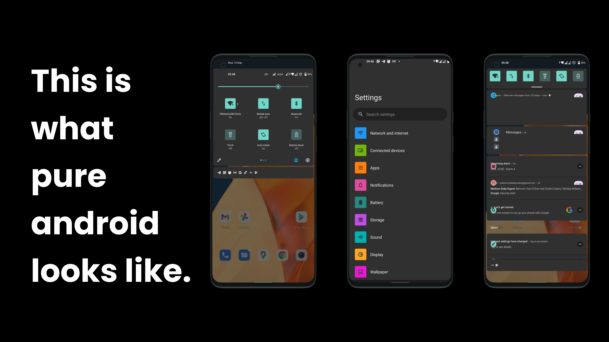
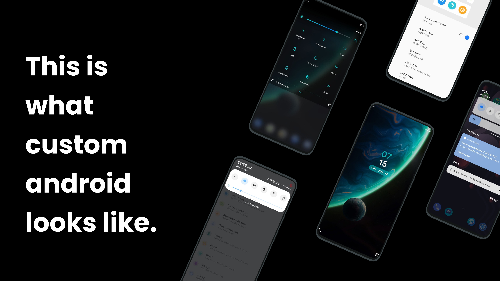

# Introduction
This is the very beginning of the whole guide, I am trying to keep it structured to make it easy navigate your way through and find exactly what you want. The more we dive into the guide the more of the structure will get defined.
For now let's get started.

## What is a Custom Rom
I suppose that now you are here reading this guide you must be having a faint idea of what a custom ROM is, nevertheless here it is.  
We all know what android is, many of us use it on our phones, it is the Operating System our mobile phones run on. As beautiful and as amazing it is, in the end it is all code. Beautifully written code to make your phone as good as it gets. This code for the whole android is Open Sourced by google, i.e. anyone who knows how to can simply download the android code and use it. It's not hidden, there are no catches, it's completely absolutely free to use. As a matter of fact let me link it [here](https://android.googlesource.com/).  
But not every android phone you use has the same UI, they feel different.  
The Most famous companies you must've heard of Samsung, Xiaomi, OnePlus, Oppo they all have their skins (own code written on top of android Code)  
Samsung - OneUI, OnePlus - Oxygen OS (OOS), Xiaomi - MiUI, Oppo - Color OS and so on.  

These are what top OEM's (Companies) provide right now, but how does the Android OS look without all these changes done on top, without the beautification without any changes, let's have a glimpse of that too. 

That doesn't look as appealing as the one's before right, that's what the companies do to android source to make it look as beautiful.  
But this is android it's open source anyone can do it, not only the companies so when any individual developer or a group decide to come together and build android from source, we like to call it a custom ROM. The below is how these look.  

This is what we aim at, this is what a custom rom is, our own flavour making the android source our own.

## Who can make a Custom ROM
Anyone, a student in school to a well experienced full stack developer. About anyone can make a custom ROM.  
Well wait adding our own code, making our own changes sounds way too complicated and scary correct ?  
Don't worry that's what this guide is there for, we'll define well structured paths to help you through and help you learn according to your pace.

## End of the Beginning
With that said, You can stick to my guide to get started and can branch out into a learning of your own, hope you find the whole experience informative and helpful.
